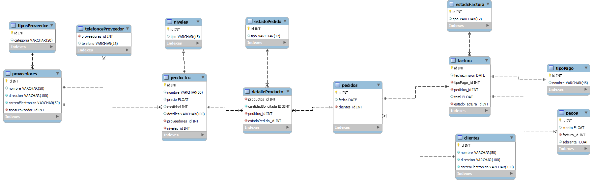

# BASE DE DATOS FACTURACION ABC


## Modelo Conceptual
ABC Ltd planea automatizar su sistema de pedidos de venta y de control de stock. Un estudio de viabilidad recomienda
encarecidamente que se instale un sistema de base de datos relacional. Los detalles de ventas y de control de stock de ABC son
los siguientes:
- Los clientes envían pedidos de productos. Cada pedido puede contener solicitudes de cantidades variables de uno o más
productos de la gama de ABC. ABC mantiene un archivo de stock que muestra los detalles de cada uno de los productos y el
proveedor preferido, la cantidad en stock, el nivel de nuevos pedidos y otros detalles.
- ABC entrega los productos que tiene en el stock en respuesta al pedido del cliente y se genera una factura por los artículos
enviados. Los artículos que no están en stock se incluyen en una lista de pedidos pendientes y estos artículos normalmente
se vuelven a pedir al proveedor preferido. En ocasiones, los artículos se piden a orígenes alternativos.
- En respuesta a las facturas que se envían a los clientes de ABC, estos envían los pagos. El pago puede corresponder a una
factura, aparte de una factura, a varias facturas o a facturas parciales.
- Identifique las tablas y campos asociados del escenario anterior.

## Modelo Fisico 


## Descripcion Tablas
-  **tiposProveedor**
   - `id` (INT): Identificador único del tipo de proveedor.
   - `categoria` (VARCHAR(20)): Categoría del proveedor.
-  **proveedores**
   - `id` (INT): Identificador único del proveedor.
   - `nombre` (VARCHAR(50)): Nombre del proveedor.
   - `direccion` (VARCHAR(100)): Dirección del proveedor.
   - `correoElectronico` (VARCHAR(50)): Correo electrónico del proveedor.
   - `tiposProveedor_id` (INT): ID del tipo de proveedor al que pertenece.
-  **telefonosProveedor**
   - `proveedores_id` (INT): ID del proveedor al que pertenece el teléfono.
   - `telefono` (VARCHAR(13)): Número de teléfono del proveedor.
-  **niveles**
   - `id` (INT): Identificador único del nivel.
   - `tipo` (VARCHAR(15)): Tipo de nivel.
-  **productos**
   - `id` (INT): Identificador único del producto.
   - `nombre` (VARCHAR(50)): Nombre del producto.
   - `precio` (FLOAT): Precio del producto.
   - `cantidad` (INT): Cantidad en stock del producto.
   - `detalles` (VARCHAR(100)): Detalles del producto.
   - `proveedores_id` (INT): ID del proveedor que suministra el producto.
   - `niveles_id` (INT): ID del nivel al que pertenece el producto.
-  **estadoPedido**
   - `id` (INT): Identificador único del estado de pedido.
   - `tipo` (VARCHAR(12)): Tipo de estado de pedido.
-  **clientes**
   - `id` (INT): Identificador único del cliente.
   - `nombre` (VARCHAR(50)): Nombre del cliente.
   - `direccion` (VARCHAR(100)): Dirección del cliente.
   - `correoElectronico` (VARCHAR(100)): Correo electrónico del cliente.
-  **pedidos**
   - `id` (INT): Identificador único del pedido.
   - `fecha` (DATE): Fecha del pedido.
   - `clientes_id` (INT): ID del cliente que realizó el pedido.
-  **detalleProducto**
   - `productos_id` (INT): ID del producto solicitado.
   - `cantidadSolicitada` (BIGINT): Cantidad solicitada del producto.
   - `pedidos_id` (INT): ID del pedido al que pertenece el detalle.
   - `estadoPedido_id` (INT): ID del estado del pedido asociado.
-  **tipoPago**
   - `id` (INT): Identificador único del tipo de pago.
   - `nombre` (VARCHAR(45)): Nombre del tipo de pago.
-  **estadoFactura**
   - `id` (INT): Identificador único del estado de factura.
   - `tipo` (VARCHAR(12)): Tipo de estado de factura.
-  **factura**
   - `id` (INT): Identificador único de la factura.
   - `fechaEmision` (DATE): Fecha de emisión de la factura.
   - `tipoPago_id` (INT): ID del tipo de pago de la factura.
   - `pedidos_id` (INT): ID del pedido asociado a la factura.
   - `total` (FLOAT): Total de la factura.
   - `estadoFactura_id` (INT): ID del estado de la factura.
-  **pagos**
   - `id` (INT): Identificador único del pago.
   - `monto` (FLOAT): Monto del pago.
   - `factura_id` (INT): ID de la factura asociada al pago.
   - `sobrante` (FLOAT): Monto sobrante del pago.


## Consultas para la base de datos

### Consultas tabla tipoProveedor

- Mostrar todos los tipos de proveedor

  ```sql
  SELECT * FROM tiposProveedor;
  ```

- Contar cuántos proveedores hay por cada tipo de proveedor

  ```sql
  SELECT tp.categoria AS Tipo_Proveedor, COUNT(p.id) AS Total_Proveedores
  FROM proveedores p
  JOIN tiposProveedor tp ON p.tiposProveedor_id = tp.id
  GROUP BY tp.categoria;
  ```

### Consultas para la tabla proveedores:

- Mostrar todos los proveedores y sus tipos

  ```sql
  SELECT p.nombre AS Proveedor, tp.categoria AS Tipo_Proveedor
  FROM proveedores p
  LEFT JOIN tiposProveedor tp ON p.tiposProveedor_id = tp.id;
  ```

- Contar cuántos productos suministra cada proveedor

  ```sql
  SELECT p.nombre AS Proveedor, COUNT(pr.id) AS Total_Productos
  FROM proveedores p
  LEFT JOIN productos pr ON p.id = pr.proveedores_id
  GROUP BY p.nombre;
  ```

### Consultas para la tabla telefonosProveedor

- Mostrar todos los números de teléfono de los proveedores

  ```sql
  SELECT p.nombre, tp.telefono
  FROM telefonosProveedor tp
  JOIN proveedores p ON tp.proveedores_id = p.id
  ;
  ```

- Contar cuántos números de teléfono tiene cada proveedor

  ```sql
  SELECT p.nombre AS Proveedor, COUNT(tp.telefono) AS Total_Telefonos
  FROM telefonosProveedor tp
  JOIN proveedores p ON tp.proveedores_id = p.id
  GROUP BY proveedores_id;
  ```

### Consultas para la tabla niveles

- Mostrar todos los niveles

  ```sql
  SELECT * FROM niveles;
  ```

- Contar cuántos productos hay en cada nivel

  ```sql
  SELECT n.tipo AS Nivel, COUNT(pr.id) AS Total_Productos
  FROM niveles n
  LEFT JOIN productos pr ON n.id = pr.niveles_id
  GROUP BY n.tipo;
  ```

###  Consultas para la tabla productos

- Mostrar todos los productos con su cantidad actual y sus proveedores

  ```sql
  SELECT pr.nombre AS Producto, pr.cantidad As cantidad, p.nombre AS Proveedor
  FROM productos pr
  LEFT JOIN proveedores p ON pr.proveedores_id = p.id;
  ```

- Encontrar los productos con precio mayor a $50

  ```sql
  SELECT nombre, precio
  FROM productos
  WHERE precio < 50;
  ```

### Consultas para la tabla estadoPedido

- Mostrar todos los estados de pedido

  ```sql
  SELECT * FROM estadoPedido;
  ```

- Encontrar el estado actual de cada pedido

  ```sql
  SELECT dp.pedidos_id AS Pedido_ID, ep.tipo AS Estado_Actual
  FROM detalleProducto dp
  LEFT JOIN estadoPedido ep ON dp.estadoPedido_id = ep.id;
  ```

### Consultas para la tabla clientes

- Mostrar todos los clientes

  ```sql
  SELECT * FROM clientes;
  ```

- Encontrar los clientes que tienen "gmail.com" en su correo electrónico

  ```sql
  SELECT nombre, correoElectronico
  FROM clientes
  WHERE correoElectronico LIKE '%gmail.com';
  ```

###  Consultas para la tabla pedidos

- Mostrar todos los pedidos y sus clientes

  ```sql
  SELECT pe.id AS Pedido_ID, pe.fecha, c.nombre AS Cliente
  FROM pedidos pe
  LEFT JOIN clientes c ON pe.clientes_id = c.id;
  ```

- Encontrar los pedidos realizados el 2023-11-06

  ```sql
  SELECT id, fecha
  FROM pedidos
  WHERE fecha > '2023-11-14';
  ```

### Consultas para la tabla detalleProducto

- Mostrar todos los detalles de productos

  ```sql
  SELECT dp.pedidos_id as id_pedido , pr.nombre as nombre_producto, dp.cantidadSolicitada as cantidad, ep.tipo as Estado
  FROM detalleProducto dp
  JOIN estadoPedido ep ON dp.estadoPedido_id = ep.id
  JOIN productos pr ON dp.productos_id = pr.id
  ;
  ```

- Encontrar los productos en estado "Pendiente"

  ```sql
  SELECT pr.nombre AS Producto, ep.tipo AS Estado
  FROM detalleProducto dp
  JOIN estadoPedido ep ON dp.estadoPedido_id = ep.id
  JOIN productos pr ON dp.productos_id = pr.id
  WHERE ep.tipo = 'Pendiente';
  ```

### Consultas para la tabla tipoPago

- Mostrar los tipos de pagos asociados a cada id de las facturas

  ```sql
  SELECT f.id as id_factura, tp.nombre as tipoPago_factura 
  FROM tipoPago tp
  JOIN factura f ON f.tipoPago_id = tp.id
  ;
  ```

- Encontrar los tipos de pago que contienen la palabra "efectivo"

  ```sql
  SELECT id,nombre AS Tipo_Pago
  FROM tipoPago
  WHERE nombre LIKE '%efectivo%';
  ```

### Consultas para la tabla estadoFactura

- Mostrar todos los estados de factura

  ```sql
  SELECT * FROM estadoFactura;
  ```

- Encontrar las facturas anuladas

  ```sql
  SELECT f.id AS Factura_ID, ef.tipo AS Estado
  FROM factura f
  JOIN estadoFactura ef ON f.estadoFactura_id = ef.id
  WHERE ef.tipo = 'Anulada';
  ```

### Consultas para la tabla factura

- Mostrar todas las facturas y sus pedidos asociados

  ```sql
  SELECT f.id AS Factura_ID, f.fechaEmision, p.id AS Pedido_ID
  FROM factura f
  LEFT JOIN pedidos p ON f.pedidos_id = p.id;
  ```

- Encontrar las facturas con un total mayor a $200

  ```sql
  SELECT id, total
  FROM factura
  WHERE total > 200;
  ```

### Consultas para la tabla pagos

- Mostrar todos los pagos y las facturas asociadas

  ```sql
  SELECT pa.id AS Pago_ID, pa.monto, f.id AS Factura_ID
  FROM pagos pa
  LEFT JOIN factura f ON pa.factura_id = f.id;
  ```

- Encontrar los pagos con un monto superior a $100

  ```sql
  SELECT id, monto
  FROM pagos
  WHERE monto > 100;
  ```

  